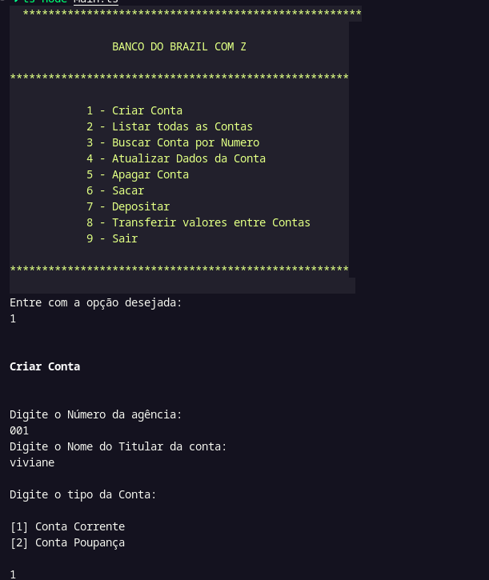

# 🏦 Sistema Conta Bancária - Projeto de Aprendizado

Um sistema de conta bancária simples desenvolvido em TypeScript/Node.js com finalidade educacional, demonstrando conceitos fundamentais de programação orientada a objetos, estruturas de dados e operações bancárias básicas.

## 📋 Funcionalidades

### 🔐 Gerenciamento de Contas
- ✅ Criação de contas correntes e poupança
- ✅ Consulta de saldo
- ✅ Listagem de todas as contas
- ✅ Busca de conta por número

### 💰 Operações Bancárias
- ✅ Depósito em conta
- ✅ Saque de conta
- ✅ Transferência entre contas
- ✅ Validação de operações

### 📊 Tipos de Conta
- **Conta Corrente**: Conta básica com operações padrão
- **Conta Poupança**: Conta com funcionalidades específicas de poupança

## 🛠️ Tecnologias Utilizadas

- **TypeScript**: Linguagem principal
- **Node.js**: Ambiente de execução

## 📁 Estrutura do Projeto

```
CONTA_BANCARIA/
├── src/
│   ├── controller/
│   │   └── AccountController.ts    # Controlador principal
│   ├── models/
│   │   ├── Account.ts              # Classe abstrata base
│   │   ├── CurrentAccount.ts       # Conta corrente
│   │   └── SavingAccount.ts        # Conta poupança
│   ├── repository/
│   │   └── AccountRepository.ts    # Interface do repositório
│   ├── util/
│   │   └── Colors.ts               # Configurações de cores
│   └── Main.ts                     # Arquivo principal
├── package.json
├── tsconfig.json
└── README.md
```

## 💡 Conceitos Aprendidos

### 🎯 Programação Orientada a Objetos
- **Herança**: Classe abstrata `Account` sendo estendida por `CurrentAccount` e `SavingAccount`
- **Encapsulamento**: Propriedades privadas e métodos públicos
- **Polimorfismo**: Comportamentos específicos para cada tipo de conta
- **Abstração**: Interface `AccountRepository` definindo contratos

### 📊 Estruturas de Dados
- **Arrays**: Armazenamento de contas em memória
- **Busca**: Implementação de busca por número da conta
- **Manipulação**: Operações de inserção, consulta e atualização

## 🎮 Exemplos de Uso



```

## 🎓 Objetivos de Aprendizado

Este projeto foi desenvolvido para praticar:
- Conceitos de POO em TypeScript
- Estruturação de projetos Node.js
- Implementação de padrões de projeto
- Validação de dados e tratamento de erros
- Organização de código e arquitetura limpa

## 🤝 Contribuições

Este é um projeto educacional! Sinta-se à vontade para:
- Fazer fork do projeto
- Sugerir melhorias
- Reportar bugs
- Adicionar novas funcionalidades

## 📄 Licença

Este projeto é apenas para fins educacionais e de aprendizado.